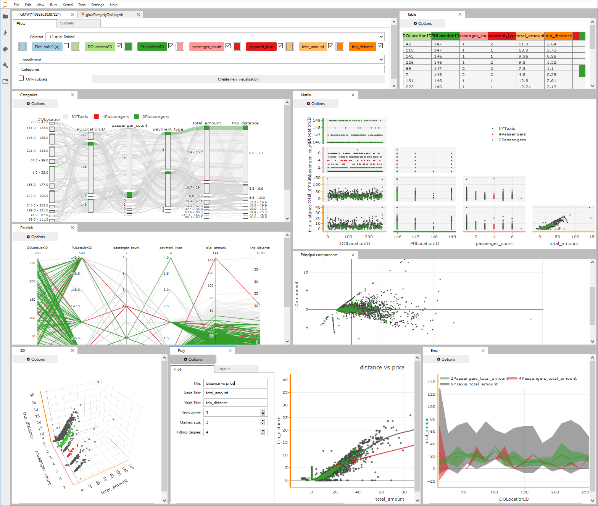
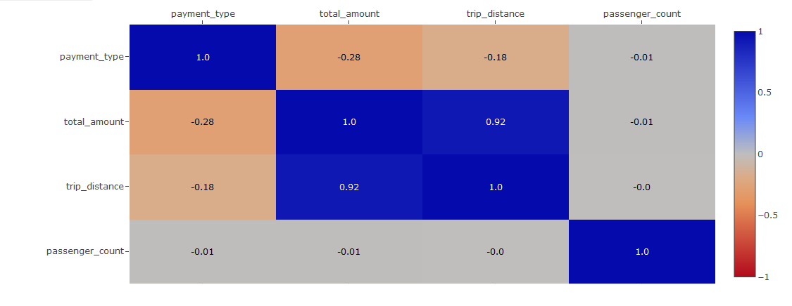

# Floatview Stats

<table>
    <tr>
        <td>Latest Release</td>
        <td>
            <a href="https://pypi.org/project/floatview/"/>
            
        </td>
    </tr>
    <tr>
        <td>PyPI Downloads</td>
        <td>
            <a href="https://pepy.tech/project/floatview"/>
            
        </td>
    </tr>
</table>

# Floatview

A floatview output widget for JupyterLab and a data explorer for glue/iplotly

## Installation

If you use jupyterlab 2.X:

```bash
pip install floatview
jupyter labextension install @jupyter-widgets/jupyterlab-manager@2.0.0
jupyter labextension install jupyterlab-plotly@4.7.1
jupyter labextension install plotlywidget@4.7.1
jupyter labextension install jupyterlab-floatview@0.3.0
```

If you use jupyterlab 1.X:

```bash
pip install floatview
jupyter labextension install @jupyter-widgets/jupyterlab-manager@1.0.1
jupyter labextension install jupyterlab-datawidgets@6.2.0
jupyter labextension install jupyterlab-plotly@1.0.0
jupyter labextension install plotlywidget@1.0.0
jupyter labextension install jupyterlab-floatview@0.2.0
```

older versions:

```bash
pip install floatview==0.1.18
jupyter labextension install @jupyterlab/plotly-extension@0.18.2
jupyter labextension install plotlywidget@0.9.1
jupyter labextension install @jupyter-widgets/jupyterlab-manager@0.38.1
jupyter labextension install jupyterlab-floatview@0.1.11
```


## Usage

The floatview widget is used as a context manager, just like ipywidgets' output
widget.

```python
from floatview import Floatview
from ipywidgets import IntSlider

sc = Floatview(title='Floatview Output', mode='tab-after')
sl = IntSlider(description='Some slider')
with sc:
    display(sl)
```


When a single output is displayed in a Floatview, it is allowed to occupy all of
the vertical space available. If more content is displayed, the natural height
is used instead.

The gluemanagerwidget is used as a data/visualization manager for a glue dataset.

```python
from floatview import GlueManagerWidget
from pandas import read_csv

data = read_csv('your_data.csv', index_col=False, usecols=cols)
gmw = GlueManagerWidget(data, modal=True, label="Data")
```




## Available Visualizations
```python
#Histogram (supports 1 component)
view = gmw.gluemanager.newView(
    "histogram",
    ["PULocationID"],
    "Histogram"
)
```


```python
#Scatter (supports 2-n components)
view = gmw.gluemanager.newView(
    "scatter",
    ["PULocationID", "DOLocationID"],
    "Scatter"
)
view = gmw.gluemanager.newView(
    "composed_scatter",
    ["trip_distance", "payment_type", 'passenger_count'],
    "Composed Scatter"
)
```


```python
#ErrorBar (supports 2-n components)
view = gmw.gluemanager.newView(
    "errorbar",
    ["trip_distance", "total_amount"],
    "Error"
)
view = gmw.gluemanager.newView(
    "composed_errorbar",
    ["trip_distance", "payment_type", 'passenger_count'],
    "Composed Error"
)
```


```python
#Polynomial Fitting 2-n degree (supports n components)
view = gmw.gluemanager.newView(
    "composed_polyfit_3d",
    ["trip_distance", "total_amount"],
    "Polyfit"
);
```


```python
#scatter 3D (supports 3 components)
view = gmw.gluemanager.newView(
    "scatter3D",
    ["trip_distance", "total_amount", "passenger_count"],
    "Scatter3D"
)
```


```python
#Contours 2D (supports 2 components)
view = gmw.gluemanager.newView(
    "contour",
    ["trip_distance", "total_amount"],
    "Contour"
);
```


```python
#Table (supports n components)
view = gmw.gluemanager.newView(
    "table",
    ['passenger_count', 'trip_distance', 'total_amount', 'payment_type'],
    "Table"
);
```


```python
#Parallel coordinatess (supports n components)
view = gmw.gluemanager.newView(
    "parallels",
    ['passenger_count', 'trip_distance', 'total_amount', 'payment_type'],
    "Parallels"
);
```


```python
#Parallel categories (supports n components)
view = gmw.gluemanager.newView(
    "parallelscat",
    ['passenger_count', 'trip_distance', 'total_amount', 'payment_type'],
    "Parallels Categ"
 );
```


```python
#Sankey (supports n components)
view = gmw.gluemanager.newView(
    "sankey",
    ['passenger_count', 'trip_distance', 'total_amount', 'payment_type'],
    "Sankey"
);
```


```python
#Sunburst (supports n components)
view = gmw.gluemanager.newView(
    "sunburst",
    ['passenger_count', 'trip_distance', 'total_amount', 'payment_type'],
    "Sunburst"
);
```


```python
#Sankey Tree (supports n components)
view = gmw.gluemanager.newView(
    "sankeytree",
    ['total_amount', 'payment_type', 'passenger_count', ],
    "Sankey Tree"
);
```


```python
#Scatter Matrix (supports n components)
view = gmw.gluemanager.newView(
    "scattermatrix",
    ['passenger_count', 'trip_distance', 'total_amount', 'payment_type'],
    "scatter Matrix"
);
```


```python
#Correlation Matrix (supports n components)
view = gmw.gluemanager.newView(
    "corrcoef",
    ['passenger_count', 'trip_distance', 'total_amount', 'payment_type'],
    "Correlation Matrix"
);
```


```python
#Principal components (supports n components)
view = gmw.gluemanager.newView(
    "pca",
    ['passenger_count', 'trip_distance', 'total_amount', 'payment_type'],
    "Principal components"
);
```


```python
#Network (supports 2 components)
view = gmw.gluemanager.newView(
    "network",
    ['trip_distance', 'total_amount'],
    "Network"
);
```


```python
#Image (supports 3 components)
view = gmw.gluemanager.newView(
    "image",
    ["trip_distance", "total_amount", 'passenger_count'],
    "Image"
);
```


```python
#Lines (supports n components)
view = gmw.gluemanager.newView(
    "composed_lines",
    ["trip_distance", "payment_type", 'passenger_count'],
    "Lines"
);
```

